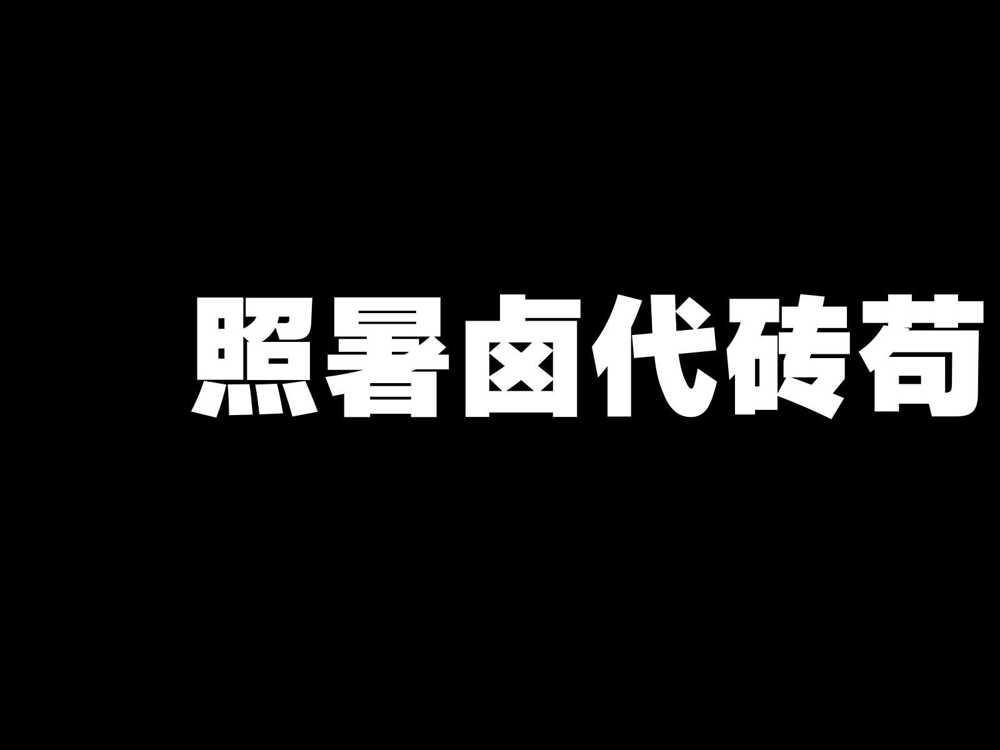
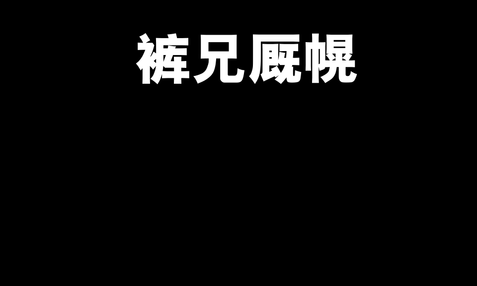
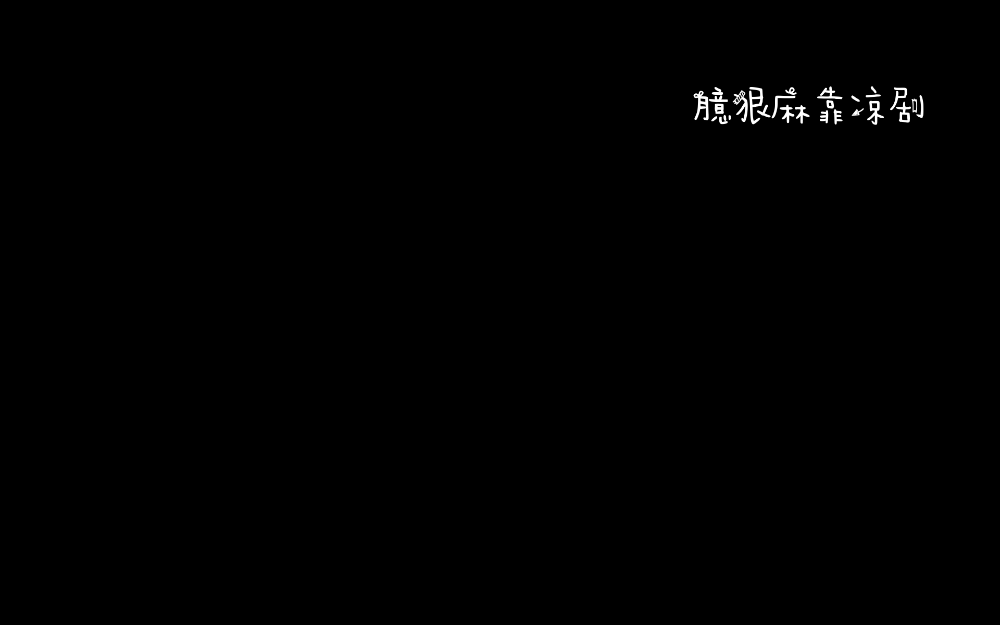
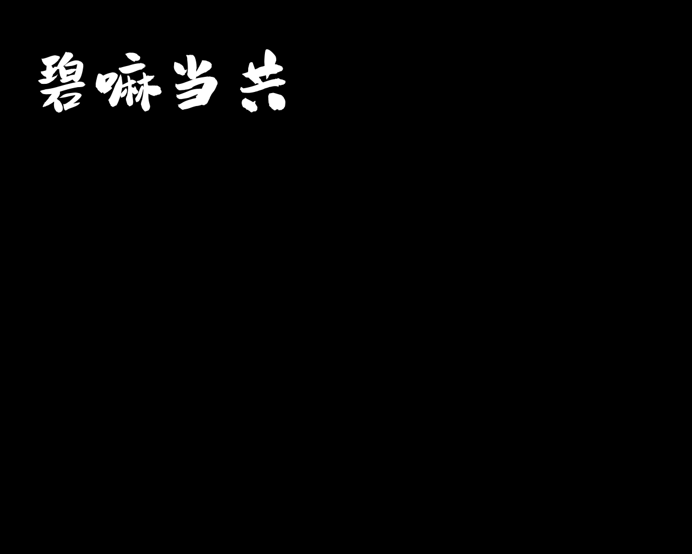
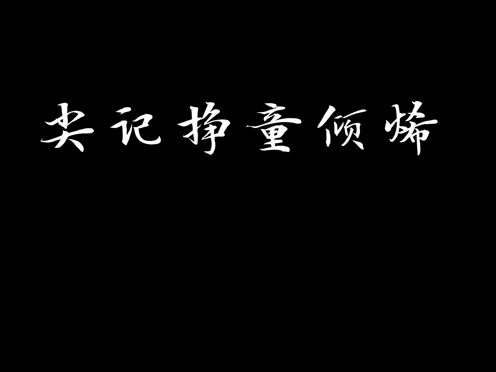
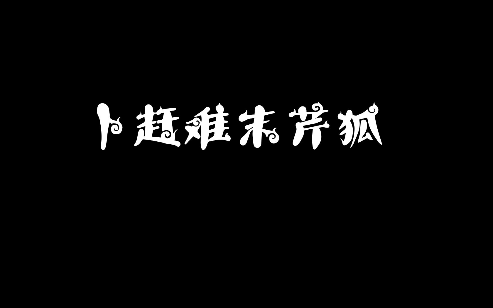

# Text-Matting-Image-Synthesis-Engine
Text Matting Image Synthesis Engine aims to synthesize a large scale high-quality text matting dataset. This dataset contributes with its diversity to the text matting research. 

The code and the collections of font and textures will be public in a short time. 
# Dataset Examples

